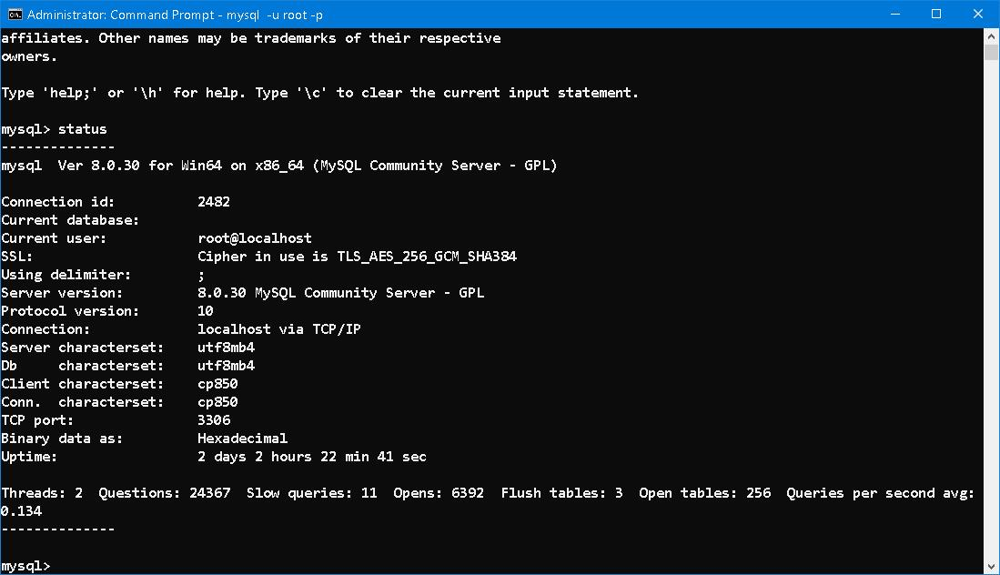
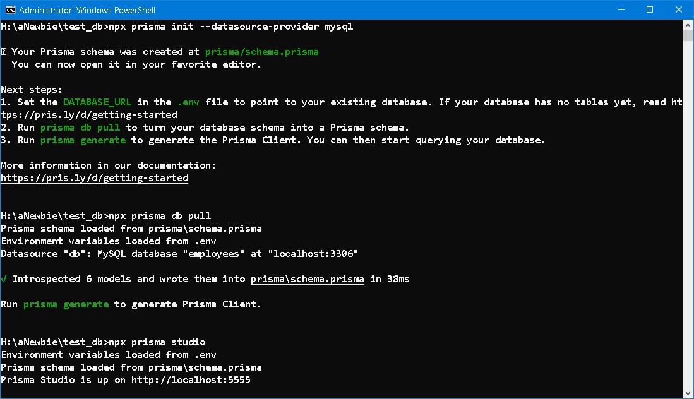

### test_db ── An Imaginary Journey

### Prologue
Coincidence! There is no such thing as coincidence and I don't think it ever exists in real life... Everything happens according to a devised plan, I mean HIS plan. Have you ever think of an old friend and later on you encounter him/her unexpectedly on street. Missing a bus but that only recalls you that there's no tea at home, your shrew wife will definitely grow furious if you ever forget it. 

Next time when something dawns on you, it is HIM who bestows you a chance to console or compensate. As you can see, help and be helped are the same thing. 

### I. Introduction
If you opt to use [NodeJS](https://nodejs.org/en) related technique and [Relational database](https://www.oracle.com/in/database/what-is-a-relational-database/), [prisma](https://www.prisma.io/) seems an obviously choice, if it were not the only choice... 

But [ORM](https://www.freecodecamp.org/news/what-is-an-orm-the-meaning-of-object-relational-mapping-database-tools/) may not be good for: 
1. Loose database schema 
2. Fast schema evolving 
3. System with complex query 
4. Flexible table joining 

In case of 1 and 2, I recommend [MongoDB](https://www.mongodb.com/) and [mongoose](https://mongoosejs.com/), which is a mature [ODM](https://www.dctacademy.com/blog/what-is-object-document-mapper-odm) solely for MongoDB. 

In case of 3 and 4, I recommend not to use ODM at all. Use [MySQL 2](https://www.npmjs.com/package/mysql2), [pg](https://www.npmjs.com/package/pg), [oracledb](https://www.npmjs.com/package/oracledb), [mssql](https://www.npmjs.com/package/mssql) and [better-sqlite3](https://www.npmjs.com/package/better-sqlite3) packages respectively. 

If you think there exists a tool fits for everything, I will give you a lollipop. 

### II. Setup 
Download [test_db](https://github.com/datacharmer/test_db) and restore to local database as described in [`README.md`](https://github.com/datacharmer/test_db/blob/master/README.md). 

> The database contains about 300,000 employee records with 2.8 million salary entries. The export data is 167 MB, which is not huge, but heavy enough to be non-trivial for testing.

Initialize and pull the schema from an existing database. 

Done! 

### III. The Journey 

### IV. Summary 

### V. Reference
1. [Comparing Prisma and Mongoose for MongoDB: A Comprehensive Analysis
](https://levelup.gitconnected.com/comparing-prisma-and-mongoose-for-mongodb-a-comprehensive-analysis-531c656fc118
)
2. [Employees Sample Database](https://dev.mysql.com/doc/employee/en/)
3. [Prisma cheat sheet](https://github.com/emanuelefavero/prisma)
4. [Laragon](https://laragon.org/index.html)
5. [Mellonta Tauta](https://poemuseum.org/mellonta-tauta/)

### Epilogue 

### EOF (2023/09/18)