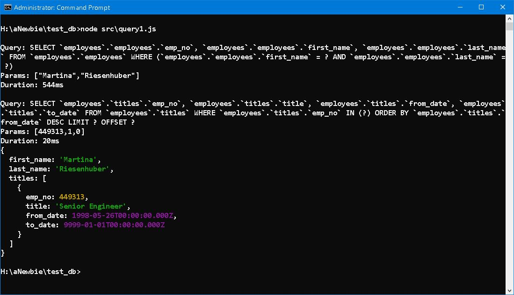
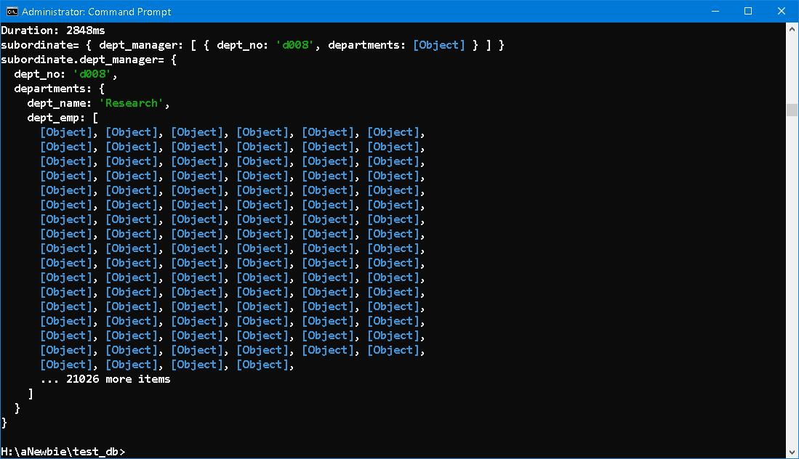
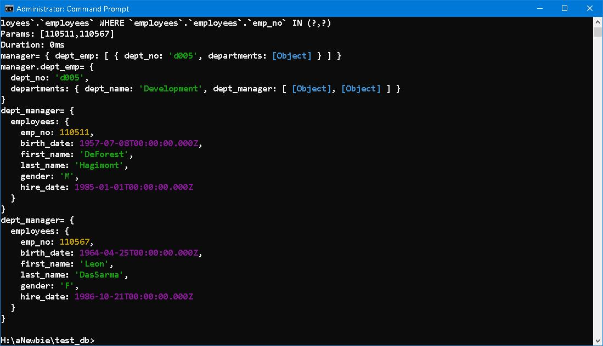

### test_db ── An Imaginary Journey


### Prologue
Coincidence! There is no such thing as coincidence and I don't think it ever exists in real life... Everything happens according to a devised plan, I mean HIS plan. Have you ever think of an old friend and later on you encounter him/her unexpectedly on street. Missing a bus but that only recalls you that there's no tea at home, your shrew wife will definitely grow furious if you ever forget it. 

Next time when something dawns on you, it is HIM who bestows you a chance to console or compensate. As you can see, help and be helped are the same thing. 


### I. Introduction
If you opt to use [NodeJS](https://nodejs.org/en) related technique and [Relational database](https://www.oracle.com/in/database/what-is-a-relational-database/), [prisma](https://www.prisma.io/) seems an obviously choice, if it were not the only choice... 

But [ORM](https://www.freecodecamp.org/news/what-is-an-orm-the-meaning-of-object-relational-mapping-database-tools/) may not be good for: 
1. Loose database schema 
2. Fast schema evolving 
3. System with complex query 
4. Flexible table joining 

In case of 1 and 2, I recommend [MongoDB](https://www.mongodb.com/) and [mongoose](https://mongoosejs.com/), which is a mature [ODM](https://www.dctacademy.com/blog/what-is-object-document-mapper-odm) solely for MongoDB. 

In case of 3 and 4, I recommend not to use ODM at all. Use [MySQL 2](https://www.npmjs.com/package/mysql2), [pg](https://www.npmjs.com/package/pg), [oracledb](https://www.npmjs.com/package/oracledb), [mssql](https://www.npmjs.com/package/mssql) and [better-sqlite3](https://www.npmjs.com/package/better-sqlite3) packages respectively. 

If you think there exists a tool fits for everything, I will give you a lollipop. 


### II. Setup 
Download [test_db](https://github.com/datacharmer/test_db) and restore to local database as described in [`README.md`](https://github.com/datacharmer/test_db/blob/master/README.md). 

> The database contains about 300,000 employee records with 2.8 million salary entries. The export data is 167 MB, which is not huge, but heavy enough to be non-trivial for testing.


Initialize and pull the schema from an existing database. 


Done! 

prisma/schema.prisma
```
generator client {
  provider = "prisma-client-js"
}

datasource db {
  provider = "mysql"
  url      = env("DATABASE_URL")
}

model departments {
  dept_no      String         @id @db.Char(4)
  dept_name    String         @unique(map: "dept_name") @db.VarChar(40)
  dept_emp     dept_emp[]
  dept_manager dept_manager[]
}

model dept_emp {
  emp_no      Int
  dept_no     String      @db.Char(4)
  from_date   DateTime    @db.Date
  to_date     DateTime    @db.Date

  employees   employees   @relation(fields: [emp_no], references: [emp_no], onDelete: Cascade, onUpdate: NoAction, map: "dept_emp_ibfk_1")
  
  departments departments @relation(fields: [dept_no], references: [dept_no], onDelete: Cascade, onUpdate: NoAction, map: "dept_emp_ibfk_2")

  @@id([emp_no, dept_no])
  @@index([dept_no], map: "dept_no")
}

model dept_manager {
  emp_no      Int
  dept_no     String      @db.Char(4)
  from_date   DateTime    @db.Date
  to_date     DateTime    @db.Date

  employees   employees   @relation(fields: [emp_no], references: [emp_no], onDelete: Cascade, onUpdate: NoAction, map: "dept_manager_ibfk_1")
  
  departments departments @relation(fields: [dept_no], references: [dept_no], onDelete: Cascade, onUpdate: NoAction, map: "dept_manager_ibfk_2")

  @@id([emp_no, dept_no])
  @@index([dept_no], map: "dept_no")
}

model employees {
  emp_no       Int              @id
  birth_date   DateTime         @db.Date
  first_name   String           @db.VarChar(14)
  last_name    String           @db.VarChar(16)
  gender       employees_gender
  hire_date    DateTime         @db.Date

  dept_emp     dept_emp[]
  dept_manager dept_manager[]
  salaries     salaries[]
  titles       titles[]
}

model salaries {
  emp_no    Int
  salary    Int
  from_date DateTime  @db.Date
  to_date   DateTime  @db.Date

  employees employees @relation(fields: [emp_no], references: [emp_no], onDelete: Cascade, onUpdate: NoAction, map: "salaries_ibfk_1")

  @@id([emp_no, from_date])
}

model titles {
  emp_no    Int
  title     String    @db.VarChar(50)
  from_date DateTime  @db.Date
  to_date   DateTime? @db.Date
  
  employees employees @relation(fields: [emp_no], references: [emp_no], onDelete: Cascade, onUpdate: NoAction, map: "titles_ibfk_1")

  @@id([emp_no, title, from_date])
}

enum employees_gender {
  M
  F
}
```


### III. The Journey 
#### Quiz 1:
```javascript 
async function main() {
  const emp_title = await prisma.employees.findMany({
    where: {
        first_name: 'Martina', 
        last_name: 'Riesenhuber'
    },
    select: {
        first_name: true,
        last_name: true,
        titles: {
            orderBy: {
                from_date: 'desc'
            },
            take: 1
        }
    }
  })
  emp_title.map(rec => console.log(rec))
}
```



#### Quiz 2:
```javascript 
async function main() {
  const subordinates = await prisma.employees.findMany({
    where: {
        first_name: 'Arie', 
        last_name: 'Staelin'
    },
    select: {
        dept_manager: {
            select: {
                dept_no: true, 
                departments: {
                    select: {
                        dept_name: true,
                        dept_emp: {
                            select: {
                                        employees: true
                                    },
                                },
                            }
                        }
                    }
                },
            }
  })
  subordinates.map(subordinate => { 
    console.log('subordinate=', subordinate) 
    subordinate.dept_manager.map(department => {
        console.log('subordinate.dept_manager=', department)
    })    
  })
}
```



#### Quiz 3:
```javascript 
async function main() {
  const managers = await prisma.employees.findMany({
    where: {
        first_name: 'Bojan', 
        last_name: 'Montemayor'
    },
    select: {
        dept_emp: {
            select: {
                dept_no: true, 
                departments: {
                    select: {
                        dept_name: true,
                        dept_manager: {
                            select: {
                                        employees: true
                                    },
                                },
                            }
                        }
                    }
                },
            }
  })
  managers.map(manager => { 
    console.log('manager=', manager) 
    manager.dept_emp.map(department => {
        console.log('manager.dept_emp=', department)
        department.departments.dept_manager.map(d => console.log('dept_manager=', d))
    })
  })
}
```



### IV. Summary 
Some people consider ORM harmful while others deeply in love with. Personally, I like to code in direct SQL but do not against writing trivial CRUD in ORM. 

> In the end, I think ORMs are an nice tool if used appropriately in the correct scenario. Once you balance out the positives and negatives however, it may seem that including an ORM in your stack may not be the best idea once your startup scales. 

> The underlying issue I saw oftentimes -- especially in the JavaScript community -- was that people treated ORMs as if they were some kind of 'silver bullet'. I've seen several large influencers on Twitter (mostly those who have only a cursory understanding of databases and SQL) highly praise ORMs for being flexible. 


### V. Reference
1. [Comparing Prisma and Mongoose for MongoDB: A Comprehensive Analysis
](https://levelup.gitconnected.com/comparing-prisma-and-mongoose-for-mongodb-a-comprehensive-analysis-531c656fc118
)
2. [Employees Sample Database](https://dev.mysql.com/doc/employee/en/)
3. [Prisma cheat sheet](https://github.com/emanuelefavero/prisma)
4. [Laragon](https://laragon.org/index.html)
5. [Why ORMs Aren't Always a Great Idea](https://dev.to/harshhhdev/why-orms-arent-always-a-great-idea-41kg)
6. [Danger of ORM](https://medium.com/swlh/danger-of-orm-d529d6ce56eb)
7. [Why ORM is a harmful pattern and should be avoided](https://kurapov.ee/eng/tech/ORM-is-harfmul-pattern/)
8. [Mellonta Tauta](https://poemuseum.org/mellonta-tauta/)


### Epilogue 
```
《無題》
花間抱月入溫柔，
願醉長臥枕吳鉤，
人間紛擾多少事，
一覺睡起已白頭。
```

### EOF (2023/09/18)